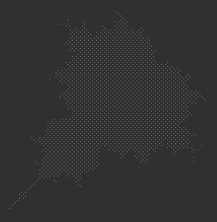

# Mandelbrot set rendering in Conway's Game of Life

## Method
- Using [APGM](https://rei1024.github.io/apgm/) to generate [APGSembly](https://conwaylife.com/wiki/APGsembly).
- Compiled by [APGSembly2 compiler](https://conwaylife.com/forums/viewtopic.php?p=199807#p199807).
- Draw on B2D component.

## Files

### `mandelbrot`
- `mandelbrot.apgm`: APGM code
- `mandelbrot.apg`: APGSembly 2.0 code
- `mandelbrot_s32_i14.mc.gz`: Initial pattern (gzipped macrocell format)
- `mandelbrot_s32_i14_rendered_gen_1.1092108e15.mc.gz`: rendered pattern at generation 1.1092108e15
- `mandelbrot.rle`: extracted mandelbrot set pattern

### `algorithm`
- Install [Deno](https://docs.deno.com/runtime/)
- Exec `deno run --allow-net --allow-read --allow-sys jsr:@std/http@^1.0.18/file-server . -p 8080`
- Open <http://localhost:8080/algorithm/02_nonnegative/index.html>
